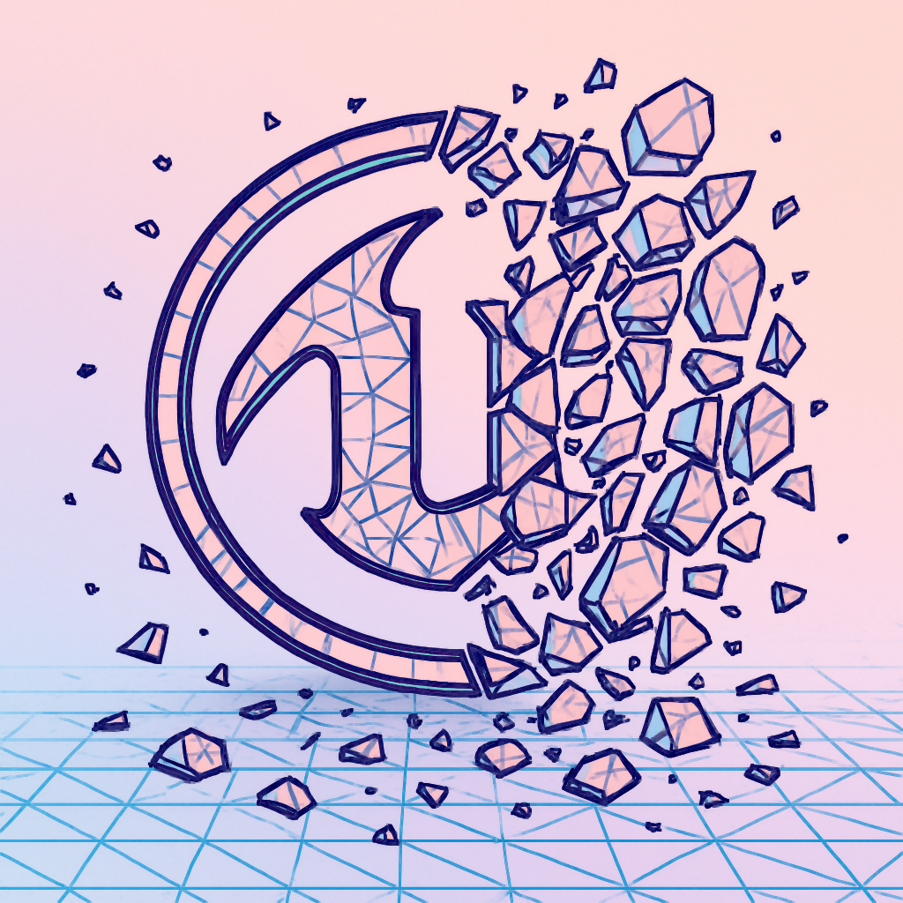
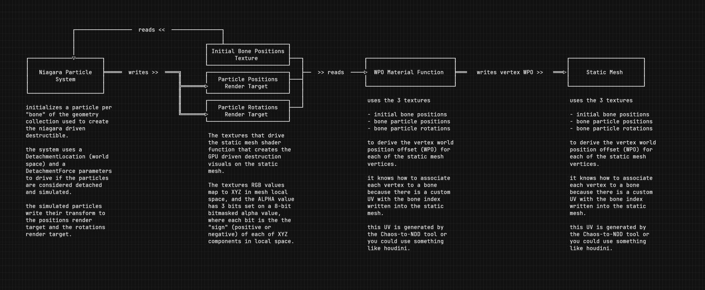
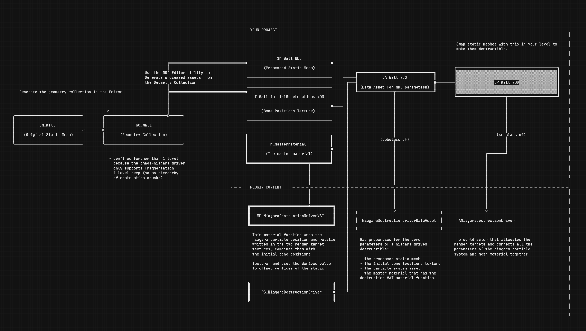


<!-- Improved compatibility of back to top link: See: https://github.com/othneildrew/Best-README-Template/pull/73 -->
<a id="readme-top"></a>


<!-- PROJECT SHIELDS -->
[![Contributors][contributors-shield]][contributors-url]
[![Forks][forks-shield]][forks-url]
[![Stargazers][stars-shield]][stars-url]
[![Issues][issues-shield]][issues-url]
[![project_license][license-shield]][license-url]
[![LinkedIn][linkedin-shield]][linkedin-url]

<!-- PROJECT LOGO -->
<br />
<div align="center">
  <a href="https://github.com/eanticev/niagara-destruction-driver">
    
  </a>

<h3 align="center">Niagara Destruction Driver</h3>

  <p align="center">
Turn CHAOS destructibles (Geometry Collection assets) into very performant GPU simulated destructible static meshes driven by Niagara particles.
    <br />
    <br />
    <a href="https://github.com/eanticev/niagara-destruction-driver/issues/new?labels=bug&template=bug-report---.md">Report Bug</a>
    &middot;
    <a href="https://github.com/eanticev/niagara-destruction-driver/issues/new?labels=enhancement&template=feature-request---.md">Request Feature</a>
  </p>
</div>

<!-- ABOUT THE PROJECT -->
## About The Project

[![Product Name Screen Shot][product-screenshot]](/)

This plugin allows you to take CHAOS destructibles (Geometry Collection assets) and process them into GPU simulated destructible static meshes driven by a Niagara Particle System. It's useful for creating cosmetic destructible props that are highly interactive but still very performant compared to CHAOS.

Under the hood the plugin uses a niagara system to simulate the physics of the fragments (bones) on the GPU, write their transforms to render targets, and finally a vertex shader to constrain the vertices of a specific fragment to its respective bone using the render targets. See more in <a href="#implementation-details">Implementation Details</a> below.

<p align="right">(<a href="#readme-top">back to top</a>)</p>


<!-- NEWS -->
## News

* 2025/03/29 - Version 0.9.0 released.

<p align="right">(<a href="#readme-top">back to top</a>)</p>


<!-- GETTING STARTED -->
## Getting Started

This project was tested with UE 5.5.4.

### Prerequisites

* Unreal Engine Project with C++ enabled.
* Recommended Engine Version 5.4 or above

### Installation

1. Drop the `NiagaraDestructionDriver` into your Game's `/Plugins` directory.
2. Right click your `uproject` file and use "Generate Visual Studio Project files".
3. Rebuild your project.

<p align="right">(<a href="#readme-top">back to top</a>)</p>


<!-- USAGE EXAMPLES -->
## Usage

Using the plugin is hopefully pretty straightforward:
* Create a CHAOS Geometry Collection from any static mesh in your project. (remember to use the TinyGEO tool to remove tiny geometry).
* Add our custom MaterialFunction to any master shaders used in your static meshes.
* Use the custom editor action to turn the Geometry Collection into a Niagara Destruction Driver blueprint.
* Drop the blueprint in a level and the included function library in BP or C++ to intiate destruction force during gameplay.

Let's walk through it assuming you already have a CHAOS geometry collection:

**STEP 1:** On the master material you use for props that want to use with this plugin enable **Use Material Attributes**, and then add the `MF_NiagaraDestructible` Material Function and set it up with the `NiagaraDestructionDriver_Enabled` static switch as shown below:


**STEP 2:** Select a Geometry Collection in the editor. (NOTE: it should have only one level of geometry chunks due to current plugin limitations). Right Click and run `Create Niagara Destruction Driver` from the menu to generate the destruction driver blueprint and backing assets (destruction data asset, initial bone location texture, and the static mesh with custom UVs to drive the GPU simulation. More info in <a href="#implementation-details">implementation details</a>)


**STEP 3:** Drop the generated blueprint (subclass of `ANiagaraDestructionDriverActor`) into your level.


**STEP 4:** Add a **Niagara Destruction Debugger** (BP_DestructibleNiagaraRigDebugger) actor to your level. Simulate and drag around the debug actor to collide with the BP from step 2. to simulate  "destruction force" on the actor.


<p align="right">(<a href="#readme-top">back to top</a>)</p>

## Creating destruction force from your own gameplay

Call `UNiagaraDestructionDriverHelper::InitiateDestructionForce` in C++ or blueprint and provide the `origin`, `radius`, and `force` parameters.

```
const FVector WorldPosition = this->GetActorLocation();
const float Radius = 250.f;
const float Force = 1.0f;
UNiagaraDestructionDriverHelper::InitiateDestructionForce(WorldPosition, Radius, Force);
```

You can do the same from a blueprint:

![initiating destruction force from blueprint][usage-destruction-force-blueprint]

<p align="right">(<a href="#readme-top">back to top</a>)</p>


<!-- FAQ -->
## FAQ

* **Why do I need to add the material function?** ... All of the destruction is driven by a shader vertex offset (WPO) so unfortunately you need to wire this up in the master prop material you plan to use in your game.
* **Why do I need the `NiagaraDestructionDriver_Enabled` static switch in my material?** ... We don't need all the shader code to be active for all your props. This plugin generates Material Instance assets for the destructibles generated, and on those instances it sets the static switch to TRUE so the vertex shader code only runs for props that are processed by this plugin.
* **Is any of this replicated?** ... No. For a poor man's solution just use and RPC and call `InitiateDestructionForce` on all clients/servers/etc.
* **Can I generate destructibles at runtime?** ... No. The underlying engine code required to process the geometry collection is editor only.
* **Can you trace for collisions for the destroyed fragments?** ... No. The fragments are animated using vertex offsets (WPO) in a shader. This system is intended for cosmetic destruction like wall surfaces and small props. In a future update we could allow this system to drive smaller chunks of a CPU driven chaos geometry collection where the larger chunks with collision etc. still work.
* **What's the point? Just use CHAOS destruction.** ... Niagara driven destructibles are more performant.
* **Why did you make this?** ... We developed a houdini driven prototype of this tech when I was CTO at **Counterplay Games**. Two very talented tech artists built that version (will update with credits here when I get permission). This is a clean room re-implementation of that system with a number of optimization and that does not require houdini.
* **I'm getting weird floating pieces in my destructibles?** ... Make sure to use the TinyGEO tool in Chaos Fracture tools to merge tiny geometry to it's neighbors.

<p align="right">(<a href="#readme-top">back to top</a>)</p>


<!-- CVARs -->
## Available CVars

| CVar                        	| Console Variable        	| Value    	| Notes                                                                                  	|
|-----------------------------	|-------------------------	|----------	|----------------------------------------------------------------------------------------	|
| **CVarNDD_DebugCollisions** 	| `r.NDD.DebugCollisions` 	| [0 or 1] 	| set this to 1 to show a debug sphere wherever `InitiateDestructionForce` is happening. 	|
| **CVarNDD_DebugMaterial**   	| `r.NDD.DebugMaterial`   	| [0 or 1] 	| use debug materials that show bones + don't need special material integration.         	|
|                             	|                         	|          	|                                                                                        	|

<p align="right">(<a href="#readme-top">back to top</a>)</p>


<!-- Implementation Details -->
## Implementation Details

### Runtime Architecture



<details>
  <summary><i>Expand for more implementation details</i></summary>

### Runtime Notes

* When using the destructible actor blueprint generated by this plugin, by default it shows proxy geometry (the static meshes used in the geometry collection) and hot swaps it for the destructible mesh with custom UVs only when destruction force actually overalps with this actor.
* To prevent occlusion culling the destroyed fragments when the mesh leaves view, we hack the mesh bounds in the destructible actor using `MeshComponent->SetBoundsScale(...)`

### Editor Asset Setup



### Editor Utilities

The editor action that processes a Geometry Collection into all the relevant assets is implemented as one static function: `UNiagaraDestructionDriverGeometryCollectionFunctions::GeometryCollectionToNiagaraDestructible` and under the hood it does four things:

1. `UNiagaraDestructionDriverGeometryCollectionFunctions::GeometryCollectionToStaticMesh` takes a geometry collection and generates a static mesh uasset with each vertex having a custom UV channel where the U value corresponds to the bone index that drives that vertex.
2. `UNiagaraDestructionDriverGeometryCollectionFunctions::SaveInitialBoneLocationsToTexture` takes a geometry collection and generates a texture uasset where each pixel is the XYZ coord initial bone location for each of the bones of the geometry collection in local space. Since RGB can't be negative, the ALPHA value is a bitmask that encodes the sign (positive/negative) of each of the RGB coords.
3. Creates a `UNiagaraDestructionDriverDataAsset` Data Asset that has references to all the generated assets in one convenient place.
4. Creates a blueprint instance of `ANiagaraDestructionDriverActor` that has all the logic to wire niagara + the static mesh up. It references the created Data Asset as well as contains stand-in proxy geometry (the original static meshes that were used to set up the geometry collection) and hot-swaps them for the Niagara Driven Destructible mesh when destruction actually occurs.


_For more info, please refer to the [Documentation](https://example.com)_

</details>

<p align="right">(<a href="#readme-top">back to top</a>)</p>


<!-- ROADMAP -->
## Roadmap


* [ ] Nanite support and testing.
* [ ] Have the custom UV channel index be a parameter instead of defaulting to index 1 (current limitation)
* [ ] Would be nice if PositionsTexture was DELTAs so it can be black / empty at resting state.
* [ ] Deal with motion blur by finishing the motion vector implementation in the VAT material function (needs RTs for previous frame bone position/rotation).
* [ ] Support for more than ONE level of chaos geometry collection.
* [ ] Support for internal structure connectivity graph to avoid "floating" pieces.
* [x] Make the destructible actor and particle system movable.
* [x] Make sure that fragments are not culled when original mesh is out of vision bounds. (did a bit of work here with `MeshComponent->SetBoundsScale`)

See the [open issues](https://github.com/eanticev/niagara-destruction-driver/issues) for a full list of proposed features (and known issues).

<p align="right">(<a href="#readme-top">back to top</a>)</p>


<!-- CONTRIBUTING -->
## Contributing

Any contributions you make are **greatly appreciated**. If you have a suggestion that would make this better, please fork the repo and create a pull request. You can also simply open an issue with the tag "enhancement".Don't forget to give the project a star! Thanks again!

1. Fork the Project
2. Create your Feature Branch (`git checkout -b feature/AmazingFeature`)
3. Commit your Changes (`git commit -m 'Add some AmazingFeature'`)
4. Push to the Branch (`git push origin feature/AmazingFeature`)
5. Open a Pull Request

<p align="right">(<a href="#readme-top">back to top</a>)</p>


<!-- LICENSE -->
## License

Distributed under the MIT License. See `LICENSE` for more information.

<p align="right">(<a href="#readme-top">back to top</a>)</p>


<!-- CONTACT -->
## Contact

Emil Anticevic - [@eanticev](https://twitter.com/eanticev)

Project Link: [https://github.com/eanticev/niagara-destruction-driver](https://github.com/eanticev/niagara-destruction-driver)

<p align="right">(<a href="#readme-top">back to top</a>)</p>


<!-- ACKNOWLEDGMENTS -->
## Acknowledgments

* (will add here when I get consent)

<p align="right">(<a href="#readme-top">back to top</a>)</p>


<!-- MARKDOWN LINKS & IMAGES -->
<!-- https://www.markdownguide.org/basic-syntax/#reference-style-links -->
[contributors-shield]: https://img.shields.io/github/contributors/eanticev/niagara-destruction-driver.svg?style=for-the-badge
[contributors-url]: https://github.com/eanticev/niagara-destruction-driver/graphs/contributors
[forks-shield]: https://img.shields.io/github/forks/eanticev/niagara-destruction-driver.svg?style=for-the-badge
[forks-url]: https://github.com/eanticev/niagara-destruction-driver/network/members
[stars-shield]: https://img.shields.io/github/stars/eanticev/niagara-destruction-driver.svg?style=for-the-badge
[stars-url]: https://github.com/eanticev/niagara-destruction-driver/stargazers
[issues-shield]: https://img.shields.io/github/issues/eanticev/niagara-destruction-driver.svg?style=for-the-badge
[issues-url]: https://github.com/eanticev/niagara-destruction-driver/issues
[license-shield]: https://img.shields.io/github/license/eanticev/niagara-destruction-driver.svg?style=for-the-badge
[license-url]: https://github.com/eanticev/niagara-destruction-driver/blob/master/LICENSE
[linkedin-shield]: https://img.shields.io/badge/-LinkedIn-black.svg?style=for-the-badge&logo=linkedin&colorB=555
[linkedin-url]: https://linkedin.com/in/emilanticevic/
[product-screenshot]: Resources/demo.webp
[step-1]: Resources/convert-geometry-collection-to-ndd.webp
[step-2]: Resources/drop-blueprint-into-level.webp
[step-3]: Resources/use-ndd-debugger.webp

[usage-destruction-force-blueprint]: Resources/destruction_force_blueprint.png

[architecture-diagram]: Resources/use-ndd-debugger.webp
[editor-setup-diagram]: Resources/use-ndd-debugger.webp
